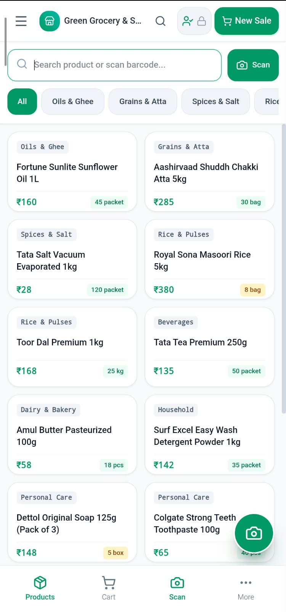
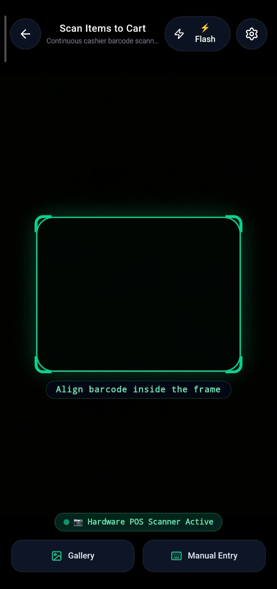
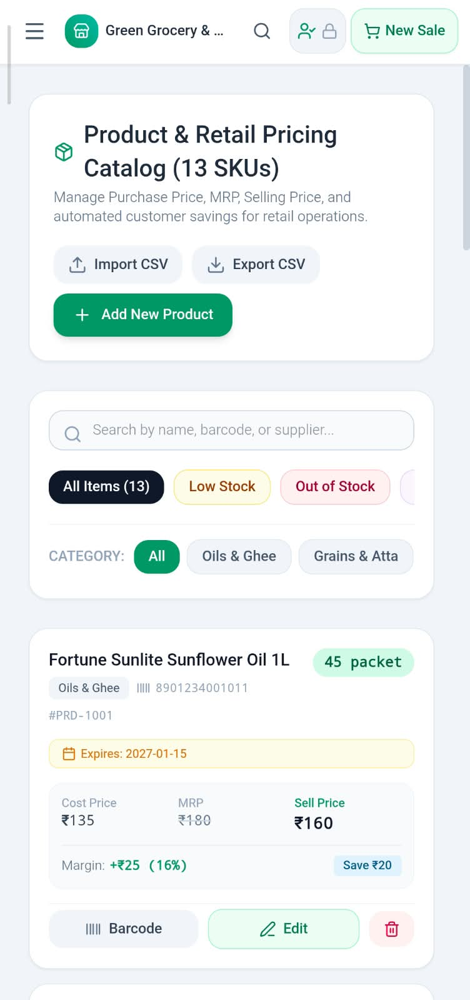
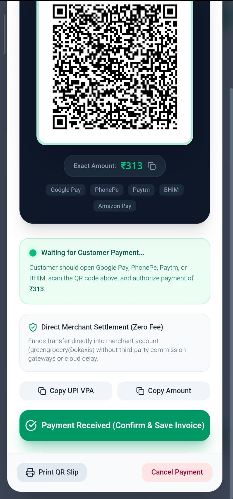

# SKmart POS – Commercial Offline Grocery POS & Inventory Management System

A commercial-grade, 100% offline Android Point of Sale (POS), Stock Batch Inventory, Customer Khata CRM, and Billing System powered by **React 19, TypeScript, Tailwind CSS v4, and Capacitor 8**.

---

## 📸 Screenshots

| Mobile POS Billing & Dynamic Cart | Live Camera Barcode Scanning with MLKit/ZXing |
| :-: | :-: |
|  |  |

| Inventory Batch & Stock Intelligence | Dynamic Merchant UPI Payment Modal |
| :-: | :-: |
|  |  |

---

## ⚡ Quick Start (The Standard 3-Step APK Build)

To build the ready-to-install Android APK on your computer:

```bash
# 1. Install dependencies
npm install

# 2. Check your environment diagnostics
npm run doctor

# 3. Build the Android APK in one command
npm run build:apk
```

📍 **Compiled APK Location:**
```
android/app/build/outputs/apk/debug/app-debug.apk
```

---

## 🚀 Resilient, Zero-Friction Build System

Unlike traditional Android repositories that fail if `gradle-wrapper.jar` is missing, damaged by ZIP extraction, or if Gradle is not globally installed:

* **Zero Global Gradle Requirement**: You **never** need to install Gradle globally or configure `gradle` in your system `PATH`.
* **Zero Manual Wrapper Downloads**: You do not need to download or search for binary JAR files manually.
* **Deterministic Gradle 8.14.3 Bootstrapping**: `npm run build:apk` automatically checks the wrapper health. If missing or damaged, it safely downloads official Gradle 8.14.3 directly from `https://services.gradle.org` over HTTPS into a local, git-ignored directory (`.gradle-tooling/`), extracts it with integrity checks, and executes the build smoothly.
* **Smart Java 17 Resolution**: Automatically detects compatible JDK 17 installations (Eclipse Adoptium Temurin, Microsoft OpenJDK, Oracle JDK, or compatible Android Studio JBR), prioritizing Java 17 to prevent Gradle class version incompatibilities (such as Java 25 class file major version 69).

---

## 📋 Prerequisites

You need the following tools installed on your computer:

1. **Node.js 20 LTS** (or newer): [Download from nodejs.org](https://nodejs.org/)
2. **Java JDK 17 (LTS)**: [Eclipse Adoptium Temurin 17](https://adoptium.net/temurin/releases/?version=17)
   - On Windows: `winget install EclipseAdoptium.Temurin.17.JDK`
3. **Android Studio** (Ladybug / Koala / Hedgehog or newer): [Download from developer.android.com](https://developer.android.com/studio)
   - During Android Studio setup, install standard **Android SDK Platform** (Android 14/15, API 34/35/36) and **Android SDK Build-Tools**.

---

## 🪟 Windows Setup & Build Guide

Open **Command Prompt (cmd.exe)** or **PowerShell** in the project directory:

```cmd
npm install
npm run doctor
npm run build:apk
```

`npm run build:apk` automatically handles the entire pipeline:
1. Compiles the modern React web application with Vite
2. Synchronizes plugins and web assets into the Android native project via Capacitor 8
3. Auto-configures Java from Android Studio if `JAVA_HOME` is not set
4. Resolves the Gradle 8.14.3 toolchain (using the wrapper or local verified distribution)
5. Compiles `assembleDebug` and writes `android\app\build\outputs\apk\debug\app-debug.apk`

---

## 🍏 macOS & 🐧 Linux Setup & Build Guide

Open Terminal in the project directory:

```bash
npm install
npm run doctor
npm run build:apk
```

---

## 🛠️ Developer Workflows

### Workflow 1: Instant Command-Line Build (Fastest)
```bash
npm install
npm run build:apk
```
Builds the complete, production-ready `app-debug.apk` directly in your terminal without opening Android Studio.

### Workflow 2: Run in Android Studio (Visual Testing & Emulators)
```bash
npm install
npm run cap:sync
npm run cap:open
```
Opens the native Android project in Android Studio for live emulator testing, USB device debugging, and Profiler inspection.

### Workflow 3: Live Web Development
```bash
npm run dev
```
Launches the live preview dev server at `http://localhost:3000`.

---

## 🩺 Environment Doctor

Run the built-in diagnostic tool anytime:

```bash
npm run doctor
```

It validates:
- Node.js version & npm readiness
- Java JDK 17 LTS (PATH, Eclipse Adoptium, Microsoft OpenJDK, or Android Studio JBR)
- Project Java 17 configuration (enforces Java 17 across all Capacitor modules)
- Android SDK location (`ANDROID_HOME` or Android Studio default)
- Android native project structure
- Gradle 8.14.3 build toolchain status

---

## 📱 App Specifications

| Feature | Details |
| :--- | :--- |
| **Application Name** | SKmart POS |
| **Package ID** | `com.skmart.pos` |
| **Mobile Runtime** | Capacitor 8 (Android Native) |
| **Frontend Stack** | React 19, TypeScript, Tailwind CSS v4 |
| **Offline Database** | Embedded SQLite with Local Storage fallback |
| **Barcode Scanning** | ML Kit Camera Scanner (Rear camera + Flash support) |
| **Printing Support** | 58mm & 80mm ESC/POS Thermal Receipt Printing |
| **UPI Payments** | Dynamic Offline Bharat QR Code Generator (`upi://pay`) |
| **Security** | 4-Digit Terminal Lock PIN with bcrypt protection |

---

## 📄 Documentation Index

* [Installation Guide](docs/INSTALLATION.md)
* [APK Build & Packaging Guide](docs/BUILD.md)
* [Frequently Asked Questions (FAQ)](docs/FAQ.md)

---

## ⚖️ License
Distributed under the **MIT License**. See [`LICENSE`](LICENSE) for more details.
